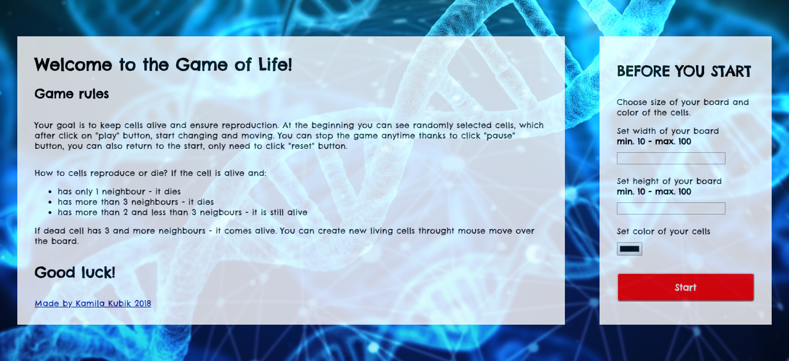
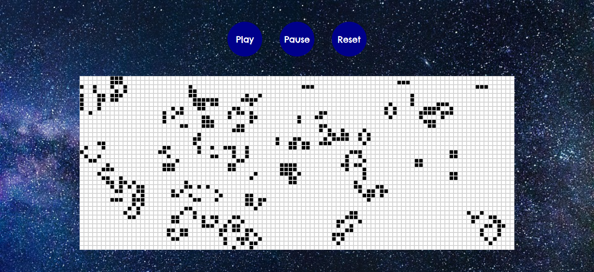

# Game of Life - JavaScript
My project "Game of Life - JavaScript" was created during Coders Lab course. I used HTML, CSS3 and JavaScript.
This is fourth step in my portfolio. I started learning HTML, CSS and JavaScript a few months ago and now I can make game as you can see.

## Used technologies
In my project I made use of, among other things:

HTML:
+ tags: section, div, button
+ attributes: id, class, href, src

CSS:
+ display: flex
+ pseudoclass: :hover,
+ background: image, size, reapet
+ border-radius
+ margin
+ padding
+ font size

JavaScript:
+ createElement
+ appendChild
+ searching DOM Elements by querySelector/All
+ addEventListener: "click"
+ loop: for
+ adding classes
+ constructors
+ functions
+ if else
+ setInterval(), clearInterval()
+ Math.ceil()
+ Math.floor()
+ Math.random()
+ parseFloat()
+ push()
+ toggle

and many more.

## Usage
To start using this game, just download whole content and run index.html file. Enjoy!
 
## Game rules


## Screenshot of Game of Life

Game On


See you next time!

```javascript
	var author = "Kamila Kubik";
	var position = "junior frontend developer";
	alert(author + " - " + position + ", 10/01/2019");
```

